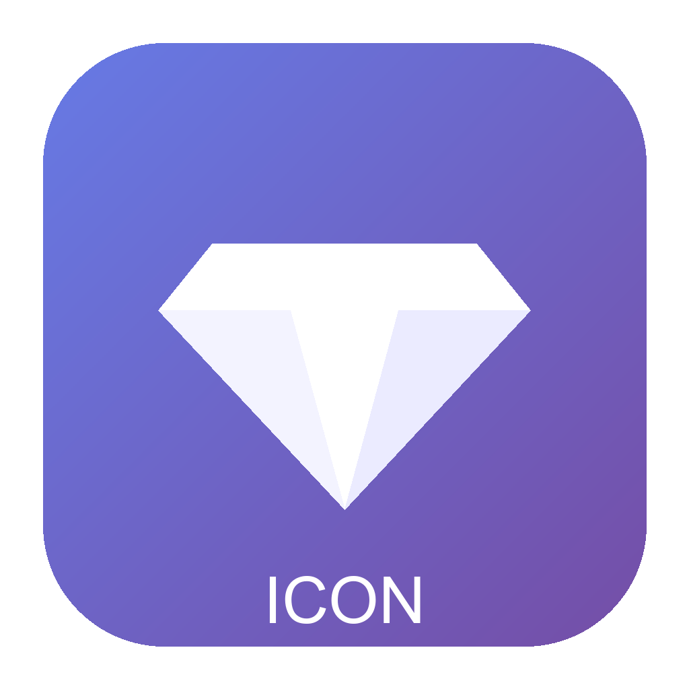
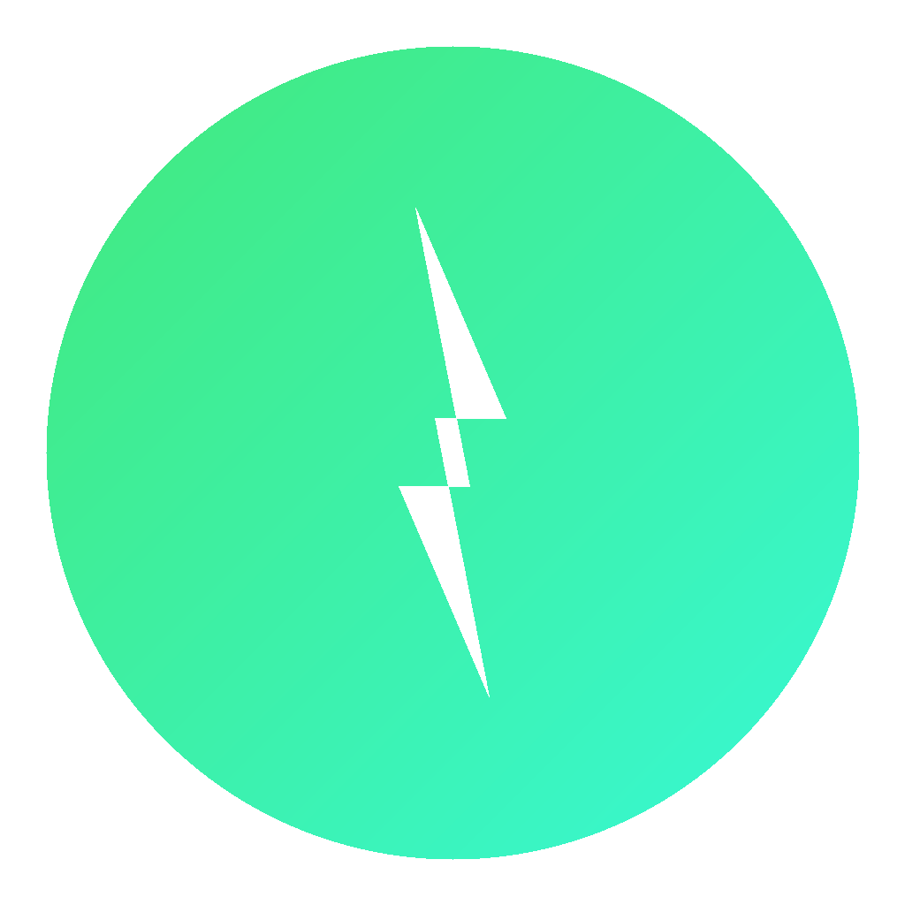

# 🎨 图标资源工具包 (Icon Resource Toolkit)

[](https://github.com/jwzz693/tubiao)
[](https://opensource.org/licenses/MIT)
[](https://github.com/jwzz693/tubiao/actions)
[](https://tubiao-ashy.vercel.app/preview.html)

> 🔗 **仓库地址**: [https://github.com/jwzz693/tubiao](https://github.com/jwzz693/tubiao)
> 
> 🌐 **在线预览**: [https://tubiao-ashy.vercel.app](https://tubiao-ashy.vercel.app/preview.html)

一站式图标生成 & 管理工具，支持所有主流平台的图标格式。从一张 1024×1024 PNG 源图自动生成 **10 种平台** 共 **78+ 个图标文件**。

## ✨ 特性

- 🖼️ 一键生成所有平台图标（Windows / macOS / Android / iOS / PWA / Electron / Web）
- 🤖 GitHub Actions 自动化 — 推送源图标后自动重新生成
- 🎨 内置 4 种精美 SVG 模板，开箱即用
- 📱 支持 Android 自适应圆形图标
- 📦 自动生成 PWA `manifest.json` 和 `browserconfig.xml`
- 🌐 社交媒体预览图（Open Graph / Twitter Card / YouTube）
- 👀 HTML 预览页面，一目了然

## �️ 图标预览

### 内置模板

<p align="center">
  &nbsp;&nbsp;&nbsp;
  &nbsp;&nbsp;&nbsp;
  &nbsp;&nbsp;&nbsp;
  
</p>

<p align="center">
  <sub>主图标</sub>&nbsp;&nbsp;&nbsp;&nbsp;&nbsp;&nbsp;&nbsp;&nbsp;&nbsp;&nbsp;&nbsp;&nbsp;&nbsp;&nbsp;&nbsp;&nbsp;&nbsp;
  <sub>应用图标</sub>&nbsp;&nbsp;&nbsp;&nbsp;&nbsp;&nbsp;&nbsp;&nbsp;&nbsp;&nbsp;&nbsp;&nbsp;&nbsp;&nbsp;&nbsp;
  <sub>Web 图标</sub>&nbsp;&nbsp;&nbsp;&nbsp;&nbsp;&nbsp;&nbsp;&nbsp;&nbsp;&nbsp;&nbsp;&nbsp;&nbsp;&nbsp;&nbsp;
  <sub>Logo 图标</sub>
</p>

### 生成的多尺寸示例

生成后的图标覆盖所有平台和尺寸：

<table align="center">
  <tr>
    <td align="center"><br><sub>16px</sub></td>
    <td align="center"><br><sub>32px</sub></td>
    <td align="center"><br><sub>48px</sub></td>
    <td align="center"><br><sub>64px</sub></td>
    <td align="center"><br><sub>96px</sub></td>
    <td align="center"><br><sub>128px</sub></td>
    <td align="center"><br><sub>256px</sub></td>
  </tr>
</table>

## �📦 支持的图标类型

| 类型 | 格式 | 尺寸 | 用途 |
|------|------|------|------|
| Windows 应用图标 | `.ico` | 16/32/48/64/128/256 | Windows 桌面应用 |
| macOS 应用图标 | `.icns` | 16~1024 | macOS 应用 |
| Favicon | `.ico` / `.png` | 16/32/48 | 网站标签页图标 |
| Web PNG | `.png` | 各种尺寸 | Web 通用 |
| Apple Touch Icon | `.png` | 120/152/167/180 | iOS 主屏幕书签 |
| Android Icon | `.png` | 36/48/72/96/144/192/512 | Android 应用 |
| PWA 图标 | `.png` | 192/512 | 渐进式 Web 应用 |
| SVG 矢量 | `.svg` | 可缩放 | Web / 设计稿 |
| Electron 图标 | `.ico`/`.icns`/`.png` | 多尺寸 | Electron 跨平台应用 |
| 社交媒体 | `.png` | 1200x630 等 | 分享预览图 |

## 🚀 快速开始

### 1. 安装依赖

```bash
pip install -r requirements.txt
```

### 2. 放置源图标

将你的原始图标（建议 1024×1024 PNG）放到 `src/` 目录：

```
src/
  └── icon.png        # 你的源图标文件（1024x1024 推荐）
```

或者使用内置的 SVG 模板：

```bash
python scripts/generate_svg.py
```

### 3. 生成所有图标

```bash
python scripts/generate_icons.py
```

生成结果将输出到 `dist/` 目录。

### 4. 预览图标

用浏览器打开 `preview.html` 预览所有生成的图标。

## 📁 项目结构

```
tubiao/
├── src/                          # 源文件
│   ├── icon.svg                  # SVG 源图标
│   └── icon.png                  # PNG 源图标（1024x1024）
├── templates/                    # SVG 图标模板
│   ├── app-icon.svg
│   ├── web-icon.svg
│   └── logo-icon.svg
├── scripts/                      # 生成脚本
│   ├── generate_icons.py         # 主生成脚本
│   ├── generate_svg.py           # SVG 模板生成
│   └── generate_manifest.py      # PWA manifest 生成
├── dist/                         # 输出目录（自动生成）
│   ├── windows/                  # Windows ICO
│   ├── macos/                    # macOS ICNS
│   ├── favicon/                  # 网站 Favicon
│   ├── apple-touch/              # Apple Touch Icons
│   ├── android/                  # Android Icons
│   ├── pwa/                      # PWA Icons
│   ├── png/                      # 通用 PNG 各尺寸
│   ├── svg/                      # SVG 矢量
│   ├── electron/                 # Electron 应用图标
│   └── social/                   # 社交媒体预览图
├── preview.html                  # 图标预览页面
├── .github/
│   └── workflows/
│       └── generate.yml          # GitHub Actions 自动生成
├── requirements.txt
├── .gitignore
└── README.md
```

## ⚙️ GitHub Actions 自动化

每次推送新的源图标到 `src/` 目录时，GitHub Actions 会自动：

1. 从 SVG 生成 PNG 源文件
2. 生成全部 10 种平台的图标
3. 生成 PWA manifest
4. 自动提交生成结果到仓库
5. 上传构建产物（Artifacts，保留 90 天）

支持手动触发：在 GitHub 仓库 → Actions → "生成图标资源" → Run workflow

## 🛠️ 自定义配置

编辑 `config.json` 来自定义生成参数：

```json
{
  "source": "src/icon.png",
  "background_color": "#ffffff",
  "theme_color": "#4a90d9",
  "border_radius": 20,
  "padding": 10
}
```

## 📄 License

MIT License

## 🙏 贡献

欢迎提交 Issue 和 Pull Request！

1. Fork 本仓库
2. 创建分支 (`git checkout -b feature/my-icon`)
3. 提交更改 (`git commit -m '添加新图标模板'`)
4. 推送分支 (`git push origin feature/my-icon`)
5. 提交 Pull Request

---

<p align="center">Made with ❤️ by <a href="https://github.com/jwzz693">jwzz693</a></p>
